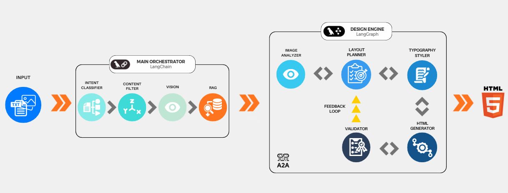

# AURA - AI 기반 매거진 레이아웃 생성기
**Agentic Unified Rendering Architecture**

<div align="center">

**멀티 에이전트 아키텍처를 활용한 지능형 매거진 레이아웃 시스템**

[](https://www.python.org/)
[](https://fastapi.tiangolo.com/)
[](https://github.com/langchain-ai/langgraph)
[](LICENSE)

</div>

---

## 📖 개요

**AURA**는 사용자가 제공한 이미지와 텍스트로부터 자동으로 전문적이고 고품질의 매거진 레이아웃을 생성하는 고급 AI 기반 시스템입니다. **LangGraph**와 **Google Gemini**를 활용한 멀티 에이전트 아키텍처를 통해 콘텐츠를 분석하고, 레이아웃을 계획하며, 픽셀 퍼펙트한 HTML/CSS 디자인을 생성합니다.

### 주요 기능

✨ **지능형 콘텐츠 분석**
- Vision AI가 이미지를 분석하여 분위기, 스타일, 시각적 키워드 추출
- 텍스트 콘텐츠의 의미론적 이해를 통한 최적 레이아웃 매칭

🎨 **멀티 에이전트 레이아웃 생성**
- 정교한 디자인 결정을 위한 6개 노드 LangGraph 워크플로우
- 이미지 분석, 레이아웃 계획, 타이포그래피, 품질 관리를 위한 전문 에이전트

🔍 **하이브리드 RAG 검색**
- Voyage AI 임베딩(voyage-3.5)을 활용한 의미론적 검색
- 512차원 임베딩을 사용하는 ChromaDB 벡터 데이터베이스
- 레이아웃 타입, 이미지 개수, 종횡비에 따른 구조적 필터링

🖼️ **적응형 레이아웃 시스템**
- **커버 레이아웃**: 텍스트 오버레이가 있는 전면 히어로 이미지
- **아티클 레이아웃**: 플로팅 이미지가 있는 동적 다단 디자인
- 콘텐츠 길이에 따른 자동 폰트 크기 및 간격 조정

🛡️ **품질 보증**
- 다단계 검증 파이프라인
- 품질 피드백을 통한 자동 재시도 메커니즘
- 텍스트/이미지 겹침 방지 및 적절한 페이지 맞춤 보장

---

## 🏗️ 아키텍처

### 시스템 구성요소

```
┌─────────────────────────────────────────────────────────────┐
│                      FastAPI 서버                            │
│                       (main.py)                              │
└────────────┬────────────────────────────────────────────────┘
             │
             ├──► RAG 모듈 (rag_voyage.py)
             │    ├─► GeminiAnalyzer: 콘텐츠 분석
             │    └─► VoyageRetriever: 레이아웃 검색
             │
             └──► MCP 서버 (mcp_server_langgraph.py)
                  └─► LangGraph 멀티 에이전트 파이프라인
                       ├─► 의도 분류기
                       ├─► 콘텐츠 필터
                       ├─► 이미지 분석기
                       ├─► 레이아웃 플래너
                       ├─► 타이포그래피 스타일러
                       ├─► HTML 생성기
                       └─► 품질 검증기
```

### 멀티 에이전트 워크플로우 (LangGraph)



### 기술 스택

| 구성요소 | 기술 | 용도 |
|---------|------|------|
| **백엔드** | FastAPI | REST API 서버 |
| **AI 모델** | Google Gemini 2.5 Pro/Flash | 콘텐츠 분석 및 생성 |
| **임베딩** | Voyage AI (voyage-3.5) | 의미론적 검색 |
| **벡터 DB** | ChromaDB | 레이아웃 저장 및 검색 |
| **오케스트레이션** | LangGraph | 멀티 에이전트 워크플로우 |
| **프론트엔드** | Vanilla HTML/CSS/JS | 사용자 인터페이스 |
| **스타일링** | Tailwind CSS | 생성된 레이아웃 |

---

## 🚀 시작하기

### 사전 요구사항

- Python 3.10 이상
- Google API 키 (Gemini용)
- Voyage AI API 키 (임베딩용)

### 설치

1. **저장소 클론**
```bash
git clone <repository-url>
cd final
```

2. **의존성 설치**
```bash
pip install -r requirements.txt
```

3. **환경 변수 설정**

프로젝트 루트에 `.env` 파일 생성:

```env
GOOGLE_API_KEY=your_google_api_key_here
VOY_API_KEY=your_voyage_api_key_here
```

4. **서버 실행**
```bash
python main.py
```

서버가 `http://localhost:8000`에서 시작됩니다.

### 최초 설정

첫 실행 시 시스템은 다음을 수행합니다:
1. RAG 모듈 초기화
2. `datas/final_final_dataset.json`에서 레이아웃 데이터셋 로드
3. Voyage AI 임베딩 생성 (몇 분 소요될 수 있음)
4. 이후 빠른 시작을 위한 캐시 파일 `index_cache_voyage.pkl` 생성

---

## 💡 사용법

### 웹 인터페이스

1. 브라우저에서 `http://localhost:8000` 접속
2. **"Add New Page"** 클릭하여 레이아웃 생성
3. 레이아웃 타입 선택:
   - **Cover**: 텍스트 오버레이가 있는 전면 히어로 이미지
   - **Article**: 다단 편집 레이아웃
4. 이미지 업로드 (1-5개 지원)
5. 제목과 본문 텍스트 입력
6. **"Generate Layout"** 클릭하여 매거진 페이지 생성

### 글자 수 제한

시스템은 레이아웃 타입에 따라 텍스트 제한을 자동으로 조정합니다:

- **Cover**: 150자
- **Article**: 
  - 기본: 2,500자
  - 추가 이미지당 300자 감소
  - 최소: 600자

### API 엔드포인트

**POST** `/analyze`

```bash
curl -X POST http://localhost:8000/analyze \
  -F "files=@image1.jpg" \
  -F "files=@image2.jpg" \
  -F 'pages_data=[{"id":"p1","title":"제목","body":"내용...","image_indices":[0,1],"layout_type":"article"}]'
```

**응답:**
```json
{
  "results": [
    {
      "page_id": "p1",
      "analysis": {
        "mood": "Professional",
        "category": "Tech",
        "type": "Balanced"
      },
      "recommendations": [...],
      "rendered_html": "<div>...</div>"
    }
  ]
}
```

---

## 📁 프로젝트 구조

```
final/
├── main.py                              # FastAPI 서버 진입점
├── rag_voyage.py                        # Voyage 임베딩을 사용하는 RAG 모듈
├── mcp_server_langgraph.py              # LangGraph 멀티 에이전트 MCP 서버
├── requirements.txt                     # Python 의존성
├── .env                                 # 환경 변수 (git에 미포함)
│
├── static/
│   └── index.html                       # 웹 UI
│
├── datas/
│   └── final_final_dataset.json         # 레이아웃 데이터셋 (239KB)
│
├── chroma_db_voyage/                    # ChromaDB 벡터 데이터베이스
├── index_cache_voyage.pkl               # 임베딩 캐시
│
├── tool/
│   └── mcp_client.py                    # AURA 서비스용 MCP 클라이언트
│
├── extra/                               # 보관/미사용 파일
│   ├── publisher.py
│   ├── test_rag.py
│   ├── image_validator.py
│   ├── dataset_fin.json
│   └── index_cache.pkl
│
└── files/                               # 추가 리소스
```

### 핵심 파일

| 파일 | 설명 |
|-----|------|
| `main.py` | FastAPI 서버, HTTP 요청 처리 및 RAG + MCP 오케스트레이션 |
| `rag_voyage.py` | Voyage AI 임베딩과 ChromaDB를 사용하는 RAG 시스템 |
| `mcp_server_langgraph.py` | 멀티 에이전트 레이아웃 생성 파이프라인 (6개 노드) |
| `static/index.html` | 실시간 미리보기가 있는 인터랙티브 웹 UI |

---

## 🔬 기술 상세

### 1. 콘텐츠 분석 파이프라인

**GeminiAnalyzer** (`rag_voyage.py`)
- 멀티모달 분석을 위해 Gemini 2.5 Flash 사용
- 추출 항목: 분위기, 카테고리, 타입, 시각적 키워드
- 레이아웃 검색을 위한 의미론적 쿼리 생성

### 2. 레이아웃 검색 (RAG)

**VoyageRetriever** (`rag_voyage.py`)
- **임베딩**: 512차원 Voyage-3.5
- **유사도**: 내적(Dot product)
- **필터**: 
  - 레이아웃 타입 (Cover/Article)
  - 이미지 개수 (1-5)
  - 종횡비 (가로/세로/정사각형)
- **폴백**: 매칭 결과가 없을 경우 점진적 필터 완화

### 3. 멀티 에이전트 생성 (LangGraph)

**6개 노드 파이프라인** (`mcp_server_langgraph.py`)

1. **의도 분류기**: 매거진 레이아웃 요청 검증
2. **콘텐츠 필터**: 부적절한 콘텐츠 확인
3. **이미지 분석기**: 히어로 이미지 및 배치 순서 결정
4. **레이아웃 플래너**: 콘텐츠 길이에 따른 레이아웃 타입 선택
5. **타이포그래피 스타일러**: 폰트, 색상, 강조 디자인
6. **HTML 생성기**: 최종 Tailwind CSS 레이아웃 생성
7. **품질 검사기**: 출력 검증, 필요 시 재시도 트리거

**레이아웃 선택 로직:**
```python
if page_type == "COVER":
    layout = "cover"
elif body_length < 200:
    layout = "grid"
elif body_length >= 1000 and image_count >= 3:
    layout = "multi-column"
else:
    layout = "float"
```

### 4. 품질 보증

**검증 항목:**
- ✅ 모든 이미지 플레이스홀더 존재
- ✅ 텍스트/이미지 겹침 없음
- ✅ 적절한 페이지 여백 및 패딩
- ✅ A4 크기 내 콘텐츠 맞춤 (794×1123px)
- ✅ 반응형 폰트 크기 조정

**재시도 메커니즘:**
- 구체적인 수정 힌트와 함께 최대 3회 재시도
- 자동 이미지 높이 감소
- 긴 텍스트에 대한 폰트 크기 조정

---

## 🎨 레이아웃 타입

### 커버 레이아웃
- **사용 사례**: 매거진 표지, 히어로 페이지
- **특징**:
  - 전면 배경 이미지
  - 텍스트 가독성을 위한 그라디언트 오버레이
  - 크고 굵은 타이포그래피
  - 최소 텍스트 (≤150자)

### 아티클 레이아웃 - Float
- **사용 사례**: 1-2개 이미지와 중간 길이 텍스트
- **특징**:
  - 이미지가 좌우로 플로팅
  - 텍스트가 이미지 주변 및 아래로 감싸기
  - 클래식 편집 매거진 스타일

### 아티클 레이아웃 - Multi-Column
- **사용 사례**: 3개 이상 이미지와 긴 텍스트 (≥1000자)
- **특징**:
  - 60% 텍스트 영역 (2단)
  - 40% 이미지 영역 (수직 스택)
  - 밀도 높은 콘텐츠를 위한 컴팩트한 간격

---

## 🔧 설정

### 모델 설정

`mcp_server_langgraph.py` 편집:
```python
class MockConfig:
    def get_llm(self, temperature=0.7):
        return ChatGoogleGenerativeAI(
            model="gemini-2.5-pro",  # 여기서 모델 변경
            temperature=temperature
        )
```

### 임베딩 차원

`rag_voyage.py` 편집:
```python
class Config:
    VOYAGE_MODEL = "voyage-3.5"
    VOYAGE_DIMENSIONS = 512  # 옵션: 256, 512, 1024, 2048
```

### 데이터셋 경로

`rag_voyage.py` 편집:
```python
class Config:
    DATASET_PATH = "./datas/final_final_dataset.json"
```

---

## 📊 성능

- **임베딩 생성**: 239개 레이아웃에 대해 약 2-3분 (최초 실행)
- **이후 시작**: 5초 미만 (캐시됨)
- **레이아웃 생성**: 페이지당 5-15초
- **검색 속도**: 의미론적 검색 100ms 미만

---

## 🐛 문제 해결

### 문제: "GOOGLE_API_KEY not found"
**해결**: 유효한 API 키가 포함된 `.env` 파일이 있는지 확인

### 문제: 시작할 때마다 임베딩 재생성
**해결**: `index_cache_voyage.pkl`이 존재하고 손상되지 않았는지 확인

### 문제: 레이아웃 생성 실패
**해결**: 
1. stderr의 MCP 서버 로그 확인
2. 이미지 파일이 유효한지 확인 (JPG/PNG)
3. 텍스트 길이가 제한 내에 있는지 확인

### 문제: 출력에 이미지가 나타나지 않음
**해결**: HTML에 이미지 플레이스홀더 `__IMAGE_0__`, `__IMAGE_1__` 등이 있는지 확인

---

## 🤝 기여

기여를 환영합니다! 다음 단계를 따라주세요:

1. 저장소 포크
2. 기능 브랜치 생성 (`git checkout -b feature/amazing-feature`)
3. 변경사항 커밋 (`git commit -m 'Add amazing feature'`)
4. 브랜치에 푸시 (`git push origin feature/amazing-feature`)
5. Pull Request 열기

---

## 📄 라이선스

이 프로젝트는 MIT 라이선스에 따라 라이선스가 부여됩니다. 자세한 내용은 [LICENSE](LICENSE) 파일을 참조하세요.

---

## 🙏 감사의 말

- **Google Gemini** - 강력한 멀티모달 AI
- **Voyage AI** - 고품질 임베딩
- **LangChain/LangGraph** - 에이전트 오케스트레이션
- **ChromaDB** - 벡터 저장소
- **FastAPI** - 웹 프레임워크

---

## 📞 문의

질문이나 지원이 필요하시면 GitHub에서 이슈를 열어주세요.

---

<div align="center">


</div>
