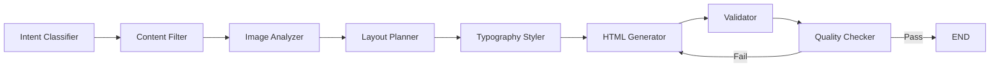

# 매거진 레이아웃 자동 생성 시스템
## 프로젝트 구조 및 RAG 방식 설명서

**목적**: 이 문서는 프로젝트의 전체 구조와 RAG(Retrieval-Augmented Generation) 방식을 다른 개발자에게 설명할 수 있도록 상세히 기술합니다.

---

## 1. 시스템 개요

### 1.1 목표
사용자가 입력한 **텍스트(제목/본문)**와 **이미지**를 기반으로, 전문 잡지 수준의 **HTML 레이아웃**을 자동 생성하는 시스템

### 1.2 핵심 기술 스택

```
┌─────────────────────────────────────────────────────────────┐
│                      사용자 입력                             │
│         (제목, 본문, 이미지 1~5장)                           │
└─────────────────────────────────────────────────────────────┘
                              │
                              ▼
┌─────────────────────────────────────────────────────────────┐
│                    RAG 시스템 (Voyage 3.5)                   │
│         - 유사 레이아웃 검색                                  │
│         - 디자인 컨텍스트 제공                                │
└─────────────────────────────────────────────────────────────┘
                              │
                              ▼
┌─────────────────────────────────────────────────────────────┐
│                  LangGraph 파이프라인                        │
│    [Intent] → [Filter] → [Analyze] → [Plan] → [Style]      │
│                    → [Generate] → [Validate] → [Quality]    │
└─────────────────────────────────────────────────────────────┘
                              │
                              ▼
┌─────────────────────────────────────────────────────────────┐
│                   최종 출력: HTML 페이지                      │
│              (A4 규격: 794×1123px)                          │
└─────────────────────────────────────────────────────────────┘
```

---

## 2. 프로젝트 폴더 구조

```
final/
├── main.py                 # FastAPI 웹 서버 (진입점)
├── rag_voyage.py           # RAG 모듈 (Voyage AI 임베딩)
├── rag_modules.py          # RAG 모듈 (BGE-M3, 레거시)
├── mcp_server_langgraph.py # LangGraph 기반 레이아웃 생성 서버
├── image_validator.py      # 이미지 검증 및 처리
│
├── tool/
│   └── mcp_client.py       # MCP 클라이언트 (서버 호출)
│
├── datas/
│   └── final_final_dataset.json  # 레이아웃 데이터셋
│
├── chroma_db_voyage/       # ChromaDB 벡터 저장소
├── static/                 # 웹 프론트엔드
└── scripts/
    └── generate_layout_dataset.py  # 데이터셋 생성 스크립트
```

---

## 3. RAG 시스템 상세

### 3.1 RAG란?

**RAG (Retrieval-Augmented Generation)**는 LLM의 생성 능력에 **외부 지식 검색**을 결합한 방식입니다.

```
┌────────────────┐     ┌────────────────┐     ┌────────────────┐
│   사용자 쿼리   │ ──▶ │  유사 문서 검색  │ ──▶ │   LLM 생성     │
│   "청량한 뷰티" │     │  (벡터 검색)    │     │  + 검색 결과   │
└────────────────┘     └────────────────┘     └────────────────┘
```

**장점**:
- LLM이 학습하지 않은 최신/도메인 특화 정보 활용 가능
- 할루시네이션(환각) 감소
- 실시간 지식 업데이트 가능

### 3.2 우리 시스템의 RAG 적용

#### 3.2.1 데이터셋 구조

`final_final_dataset.json`에 저장된 각 레이아웃 정보:

```json
{
  "image_id": "layout_001",
  "image_path": "./image_data/layout_001.jpg",
  "mood": "Professional",
  "category": "Beauty / Skincare",
  "type": "Article",
  "description": "A clean minimalist layout with product photography...",
  "elements": [
    {"type": "title", "coordinates": {"x1": 50, "y1": 80, "x2": 700, "y2": 150}, "text": "..."},
    {"type": "body", "coordinates": {"x1": 50, "y1": 200, "x2": 400, "y2": 800}, "text": "..."},
    {"type": "figure", "coordinates": {"x1": 420, "y1": 200, "x2": 750, "y2": 500}}
  ]
}
```

---

### 3.3 임베딩 모델: Voyage AI 3.5

#### 3.3.1 왜 Voyage AI를 선택했는가?

| 항목 | Voyage 3.5 | BGE-M3 (기존) |
|:---|:---|:---|
| **타입** | Cloud API | 로컬 모델 |
| **차원** | 512 (MRL 지원) | 1024 |
| **특화** | Retrieval | General |
| **속도** | 빠름 (API) | 느림 (GPU 필요) |
| **비용** | 무료 200M 토큰 | 무료 (하드웨어 필요) |

**Matryoshka Representation Learning (MRL)**:
- 러시아 인형처럼 벡터를 **중첩 구조**로 학습
- 2048 → 1024 → 512 → 256 차원으로 줄여도 성능 유지
- 저장 공간 절약 + 검색 속도 향상

---

#### 3.3.2 MRL (Matryoshka Representation Learning) 상세 설명

**MRL이란?**

2022년 Google Research에서 발표한 임베딩 학습 기법으로, **러시아 마트료시카 인형**처럼 벡터를 **중첩 구조**로 학습합니다.

```
┌────────────────────────────────────────────────────────────────┐
│  일반 임베딩 (2048차원)                                          │
│  [v1, v2, v3, v4, ..., v2048]                                  │
│                                                                │
│  ✘ 앞부분만 자르면? → 정보 손실 심각, 성능 급락                   │
└────────────────────────────────────────────────────────────────┘

┌────────────────────────────────────────────────────────────────┐
│  MRL 임베딩 (2048차원)                                          │
│                                                                │
│  ┌──────────────────────────────────────────────────────────┐  │
│  │ 256차원  │ 512차원    │ 1024차원      │ 2048차원         │  │
│  │ [▓▓▓▓▓▓] │ [▓▓▓▓▓▓▓▓] │ [▓▓▓▓▓▓▓▓▓▓▓] │ [▓▓▓▓▓▓▓▓▓▓▓▓▓]│  │
│  │ 핵심정보 │ + 추가정보  │ + 세부정보    │ + 미세정보      │  │
│  └──────────────────────────────────────────────────────────┘  │
│                                                                │
│  ✓ 앞부분만 잘라도 → 핵심 정보 유지, 성능 거의 동일!            │
└────────────────────────────────────────────────────────────────┘
```

**학습 방식**:

```python
# 일반 학습: 전체 벡터에만 Loss 적용
loss = contrastive_loss(full_embedding)

# MRL 학습: 여러 차원에서 동시에 Loss 적용
loss = (
    contrastive_loss(embedding[:256]) * 0.1 +   # 256차원 부분
    contrastive_loss(embedding[:512]) * 0.2 +   # 512차원 부분
    contrastive_loss(embedding[:1024]) * 0.3 +  # 1024차원 부분
    contrastive_loss(embedding[:2048]) * 0.4    # 전체 2048차원
)
```

**벤치마크 성능 비교** (MTEB Retrieval 기준):

| 차원 | 일반 임베딩 | MRL 임베딩 | 차이 |
|:---:|:---:|:---:|:---:|
| 2048 | 0.85 | 0.85 | - |
| 1024 | 0.70 | **0.84** | +0.14 |
| 512 | 0.55 | **0.82** | +0.27 |
| 256 | 0.35 | **0.78** | +0.43 |

**실용적 이점**:

| 이점 | 설명 |
|:---|:---|
| **저장 공간 75% 절약** | 2048 → 512차원 = 1/4 크기 |
| **검색 속도 4배 향상** | 더 작은 벡터 = 더 빠른 Dot Product |
| **비용 절감** | 벡터 DB 저장 비용 감소 |
| **유연한 트레이드오프** | 정확도 vs 속도 상황에 맞게 조절 가능 |

**Voyage AI에서 MRL 사용**:

```python
# 최대 차원 (가장 정확)
result = client.embed(texts, model="voyage-3.5", output_dimension=2048)

# MRL로 축소 (우리 시스템 - 균형잡힌 선택)
result = client.embed(texts, model="voyage-3.5", output_dimension=512)

# 최소 차원 (가장 빠름)
result = client.embed(texts, model="voyage-3.5", output_dimension=256)
```

> 💡 **우리 시스템의 선택**: 512차원
> - 정확도: 2048차원 대비 ~97% 유지
> - 속도: 4배 빠른 검색
> - 저장: ChromaDB 용량 75% 절약

#### 3.3.2 Dot Product vs Cosine Similarity

```
기존: Cosine Similarity
- 두 벡터의 각도(방향) 비교
- 정규화 필요
- 수식: cos(θ) = (A · B) / (||A|| ||B||)

현재: Dot Product (Inner Product)
- 두 벡터의 내적
- 정규화된 벡터에서는 Cosine과 동일
- 수식: A · B = Σ(ai × bi)
- 장점: 계산이 더 단순하고 빠름
```

Voyage AI는 **정규화된 벡터**를 반환하므로 Dot Product = Cosine Similarity

---

### 3.4 ChromaDB 설정

#### 3.4.1 컬렉션 생성

```python
self.chroma_client = chromadb.PersistentClient(path="./chroma_db_voyage")
self.collection = self.chroma_client.get_or_create_collection(
    name="magazine_layouts_voyage",
    metadata={"hnsw:space": "ip"}  # Inner Product (Dot Product)
)
```

| 파라미터 | 값 | 설명 |
|:---|:---|:---|
| `path` | `./chroma_db_voyage` | 영구 저장 경로 |
| `name` | `magazine_layouts_voyage` | 컬렉션 이름 |
| `hnsw:space` | `ip` | 유사도 메트릭 (Inner Product) |

#### 3.4.2 HNSW 알고리즘

ChromaDB는 **HNSW (Hierarchical Navigable Small World)** 알고리즘 사용:

```
┌─────────────────────────────────────────┐
│           Layer 3 (최상위)               │
│     ●───────────────●                   │
│     │               │                   │
├─────┼───────────────┼───────────────────┤
│     │  Layer 2      │                   │
│     ●───●───●───────●───●               │
│     │   │   │       │   │               │
├─────┼───┼───┼───────┼───┼───────────────┤
│     │   │   │       │   │  Layer 1      │
│   ●─●───●───●───●───●───●───●───●       │
│   │ │   │   │   │   │   │   │   │       │
├───┼─┼───┼───┼───┼───┼───┼───┼───┼───────┤
│   │ │   │   │   │   │   │   │   │       │
│   ●─●───●───●───●───●───●───●───●───●   │
│   Layer 0 (모든 데이터)                  │
└─────────────────────────────────────────┘
```

- **장점**: O(log N) 검색 복잡도
- **단점**: 인덱스 빌드 시간 필요

---

### 3.5 인덱싱 프로세스

#### 3.5.1 문서 텍스트 포맷팅

```python
def _format_layout_text(self, item: Dict) -> str:
    """레이아웃 데이터를 검색 가능한 텍스트로 변환"""
    text_parts = [
        f"Category: {item.get('category', 'Unknown')}",  # "Beauty / Skincare"
        f"Type: {item.get('type', 'Unknown')}",          # "Article"
        f"Mood: {item.get('mood', 'Unknown')}",          # "Professional"
        f"Description: {item.get('description', '')}"    # "A clean minimalist..."
    ]
    
    # 레이아웃 내 텍스트 요소도 포함
    for elem in item.get('elements', []):
        if elem.get('text'):
            text_parts.append(elem['text'])
    
    return "\n".join(text_parts)
```

**예시 출력**:
```
Category: Beauty / Skincare
Type: Article
Mood: Professional
Description: A clean minimalist layout with product photography
```

#### 3.5.2 구조적 메타데이터 추출

```python
# 이미지 개수 계산
image_elements = [e for e in elements if e['type'] == 'figure']
img_count = len(image_elements)

# 레이아웃 비율 분석 (가장 큰 이미지 기준)
largest_img = max(image_elements, key=lambda x: width * height)
if width > height * 1.1:
    layout_ratio = "Horizontal"
elif height > width * 1.1:
    layout_ratio = "Vertical"
else:
    layout_ratio = "Square"
```

| 메타데이터 | 값 예시 | 용도 |
|:---|:---|:---|
| `image_count` | 3 | 필터링 |
| `layout_ratio` | "Vertical" | 필터링 |
| `type` | "Article" / "Cover" | 필터링 |
| `mood` | "Professional" | 벡터 검색 |
| `category` | "Beauty" | 벡터 검색 |

#### 3.5.3 Voyage API 호출

```python
def _get_voyage_embeddings(self, texts: List[str], input_type: str) -> List[List[float]]:
    """
    Voyage AI API로 임베딩 생성
    
    Args:
        texts: 임베딩할 텍스트 리스트
        input_type: "document" (인덱싱) 또는 "query" (검색)
    """
    result = self.client.embed(
        texts,
        model="voyage-3.5",
        input_type=input_type,         # document vs query 구분
        output_dimension=512           # MRL: 2048→512로 축소
    )
    return result.embeddings
```

> ⚠️ **중요**: `input_type`이 다르면 같은 텍스트도 **다른 벡터** 생성
> - `document`: 저장할 문서용 벡터
> - `query`: 검색 쿼리용 벡터

---

### 3.6 캐싱 메커니즘

#### 3.6.1 캐시 저장 구조

```python
# 캐시 파일: ./index_cache_voyage.pkl
{
    'version': 'voyage-1.0-ip-a3f2b1c8',  # 버전 해시
    'doc_map': {...},                      # 문서 ID → 원본 데이터 매핑
    'doc_ids': [...]                       # 문서 ID 리스트
}
```

#### 3.6.2 캐시 무효화 조건

```python
def _load_from_cache(self) -> bool:
    # 1. 캐시 파일 없음
    if not os.path.exists(self.cache_path):
        return False
    
    # 2. 데이터셋이 캐시보다 최신
    if os.path.getmtime(DATASET_PATH) > os.path.getmtime(self.cache_path):
        return False  # 재인덱싱 필요
    
    # 3. 버전 불일치 (코드 변경됨)
    if cached_version != self.CACHE_VERSION:
        return False
    
    return True
```

**버전 해시 생성**:
```python
import hashlib, inspect

logic_source = inspect.getsource(self.index_data)  # 인덱싱 함수 소스
logic_hash = hashlib.md5(logic_source.encode()).hexdigest()[:8]
distance_metric = "ip"

CACHE_VERSION = f"voyage-1.0-{distance_metric}-{logic_hash}"
# → "voyage-1.0-ip-a3f2b1c8"
```

---

### 3.7 검색 흐름

#### 3.7.1 전체 검색 과정

```
┌─────────────────────────────────────────────────────────────┐
│ 1. 사용자 입력 분석 (Gemini)                                 │
│    images, title, body → {"mood": "Professional", ...}      │
└─────────────────────────────────────────────────────────────┘
                              │
                              ▼
┌─────────────────────────────────────────────────────────────┐
│ 2. 검색 쿼리 구성                                            │
│    "Professional Calm White Beauty Skincare Balanced"       │
└─────────────────────────────────────────────────────────────┘
                              │
                              ▼
┌─────────────────────────────────────────────────────────────┐
│ 3. 필터 구성 (Cascading Fallback)                           │
│    시도 1: {type: Article, image_count: 3, layout_ratio: V} │
│    시도 2: {type: Article, image_count: 3}                  │
│    시도 3: {type: Article}                                  │
│    시도 4: {} (필터 없음)                                   │
└─────────────────────────────────────────────────────────────┘
                              │
                              ▼
┌─────────────────────────────────────────────────────────────┐
│ 4. Voyage API 쿼리 임베딩                                    │
│    query → [0.234, -0.156, 0.089, ...]  (512차원)          │
└─────────────────────────────────────────────────────────────┘
                              │
                              ▼
┌─────────────────────────────────────────────────────────────┐
│ 5. ChromaDB 벡터 검색 (Dot Product)                          │
│    query_vector · doc_vectors → similarity scores          │
└─────────────────────────────────────────────────────────────┘
                              │
                              ▼
┌─────────────────────────────────────────────────────────────┐
│ 6. Top-K 결과 반환                                           │
│    [{image_id: "layout_042", similarity: 0.89, ...}, ...]  │
└─────────────────────────────────────────────────────────────┘
```

#### 3.7.2 Cascading Fallback 전략

```python
# main.py에서 구현
def search_with_fallback(query, filters):
    filter_attempts = [
        {'type': db_type, 'image_count': img_count, 'layout_ratio': ratio},
        {'type': db_type, 'image_count': img_count},
        {'type': db_type},
        {}  # 필터 없음
    ]
    
    for f in filter_attempts:
        results = retriever.search(query, filters=f, top_k=5)
        if len(results) > 0:
            return results
    
    return []
```

이 전략은 필터가 너무 **restrictive**할 때 자동으로 완화:

```
🔍 Trying filters: {type: Article, image_count: 3, layout_ratio: Vertical}
   Found 0 results
🔍 Trying filters: {type: Article, image_count: 3}
   Found 0 results
🔍 Trying filters: {type: Article}
   Found 2 results ✓
```

#### 3.7.3 검색 결과 활용

검색된 레이아웃 정보는 **LangGraph 노드**로 전달:

```python
# 검색 결과 중 가장 유사한 레이아웃
best_match = results[0]
layout_data = retriever.get_layout(best_match['image_id'])

# LangGraph에 전달되는 컨텍스트
plan_json = {
    "reference_id": layout_data['image_id'],
    "elements": layout_data['elements'],  # 좌표 정보
    "spatial_summary": "3 images, 2 text blocks. Top-heavy.",
    "suggested_strategy": "Mosaic or Grid"
}
```

**HTML Generator가 참조하는 정보**:
- 참조 레이아웃의 **요소 배치** (좌표)
- 이미지/텍스트 **비율 분석**
- 추천 **레이아웃 전략** (Grid, Float 등)

---

### 3.8 전체 코드 의사 흐름

```python
# 1. 초기화
analyzer = GeminiAnalyzer()          # Gemini 2.5 Flash
retriever = VoyageRetriever()        # Voyage 3.5 + ChromaDB

# 2. 사용자 입력 수신
images = [img1, img2, img3]
title = "Functional Skincare + Light Protection"
body = "After applying functional skincare products..."

# 3. Gemini 분석
analysis = analyzer.analyze_page(images, title, body)
# → {"mood": "Professional", "category": "Beauty", "type": "Balanced"}

# 4. 검색 쿼리 구성
query = f"{analysis['mood']} {analysis['category']} {analysis['description']}"

# 5. RAG 검색
results = retriever.search(
    query=query,
    filters={"type": "Article", "image_count": 3},
    top_k=5
)

# 6. 최상위 결과로 레이아웃 힌트 구성
best_layout = retriever.get_layout(results[0]['image_id'])

# 7. LangGraph로 HTML 생성
html = mcp_client.generate_layout(
    headline=title,
    body=body,
    image_data=images,
    vision_json=analysis,
    design_json=best_layout
)
```

---

## 4. LangGraph 파이프라인

### 4.1 노드 구성



### 4.2 각 노드 역할

| 노드 | 역할 | 출력 |
|:---|:---|:---|
| **Intent Classifier** | 잡지 관련 요청인지 확인 | `intent_valid: true/false` |
| **Content Filter** | 부적절 콘텐츠 필터링 | `content_safe: true/false` |
| **Image Analyzer** | HERO 이미지 선정, 배치 결정 | `{"hero_index": 0, "placements": {...}}` |
| **Layout Planner** | float vs multi-column 결정 | `{"layout_type": "multi-column"}` |
| **Typography Styler** | 폰트 크기, 강조 구문 결정 | `{"accent_color": "text-blue-600"}` |
| **HTML Generator** | 최종 HTML 생성 | `<div class="w-[794px]...">...</div>` |
| **Validator** | 기본 검증 (이미지 누락 등) | `{"passed": true/false}` |
| **Quality Checker** | 상세 품질 검수 + 재시도 | `{"issues": [], "fixes": []}` |

### 4.3 재시도 메커니즘

Quality Checker에서 문제 발견 시 HTML Generator로 **루프백**:

```
HTML Generator → Validator → Quality Checker
       ↑                              │
       │        ❌ 실패 (retry < 3)   │
       └──────────────────────────────┘
```

최대 **3회 재시도** 후 최종 HTML 반환

---

## 5. 핵심 파일 설명

### 5.1 main.py (FastAPI 서버)

```python
@app.post("/analyze")
async def analyze_pages(...):
    # 1. 이미지 로드
    # 2. Gemini로 콘텐츠 분석
    # 3. RAG 검색 (유사 레이아웃)
    # 4. MCP 서버 호출 (LangGraph)
    # 5. 최종 HTML 반환
```

### 5.2 rag_voyage.py (RAG 모듈)

```python
class VoyageRetriever:
    def __init__(self):
        # Voyage AI 클라이언트 초기화
        # ChromaDB 연결
        # 데이터셋 인덱싱

    def search(self, query, filters, top_k=5):
        # 1. 쿼리 임베딩 생성
        # 2. ChromaDB 벡터 검색
        # 3. 메타데이터 필터 적용
        # 4. 상위 K개 결과 반환
```

### 5.3 mcp_server_langgraph.py (생성 서버)

```python
def build_magazine_graph():
    graph = StateGraph(MagazineState)
    
    # 노드 추가
    graph.add_node("intent_classifier", ...)
    graph.add_node("html_generator", ...)
    graph.add_node("quality_checker", ...)
    
    # 엣지 연결
    graph.add_edge("validator", "quality_checker")
    graph.add_conditional_edges(
        "quality_checker",
        quality_check_router,
        {"retry": "html_generator", "end": END}
    )
    
    return graph.compile()
```

---

## 6. 데이터 흐름 요약

```
[사용자 입력]
     │
     ▼
[main.py] ─────────────────────────────────────────────┐
     │                                                  │
     ▼                                                  │
[rag_voyage.py]                                        │
     │ 1. Gemini로 콘텐츠 분석                          │
     │ 2. Voyage로 쿼리 임베딩                          │
     │ 3. ChromaDB에서 유사 레이아웃 검색               │
     │                                                  │
     ▼                                                  │
[mcp_client.py] ───▶ [mcp_server_langgraph.py]        │
                            │                          │
                            ▼                          │
                     [LangGraph 8노드]                 │
                            │                          │
                            ▼                          │
                     [최종 HTML]                       │
                            │                          │
◀───────────────────────────┴──────────────────────────┘
     │
     ▼
[브라우저 렌더링]
```

---

## 7. 핵심 개념 정리

| 개념 | 설명 |
|:---|:---|
| **RAG** | 검색 + 생성을 결합하여 LLM 출력 품질 향상 |
| **Voyage 3.5** | 검색에 특화된 임베딩 모델 (512차원) |
| **ChromaDB** | 벡터 데이터베이스 (유사도 검색) |
| **LangGraph** | LLM 워크플로우를 그래프로 관리 |
| **MCP** | Model Context Protocol (서버-클라이언트 통신) |
| **Quality Checker** | 생성된 HTML 품질 검수 + 재시도 |

---

## 8. 확장 포인트

1. **데이터셋 확장**: `scripts/generate_layout_dataset.py`로 새 이미지 분석
2. **임베딩 모델 변경**: `rag_voyage.py`의 `Config` 수정
3. **노드 추가**: `mcp_server_langgraph.py`의 `build_magazine_graph()` 수정
4. **품질 기준 조정**: `html_quality_checker_node()` 휴리스틱 수정
